# Desafios Flutter

Implementação de três desafios práticos focados em lógica, cálculos do dia a dia e armazenamento local no dispositivo.

---

##  Desafios

### 1. Caminhadas x Calorias (`flutter_desafio1`)
Aplicativo para registrar histórico de caminhadas e calcular a estimativa de gasto calórico médio.
* **Fórmula:** `Gasto Calórico = Peso (kg) × Distância (km) × 0.7`
* **Recursos:** Splash screen com tema escuro, listagem de registros, cadastro/edição via modal e persistência local.

<p align="center">
  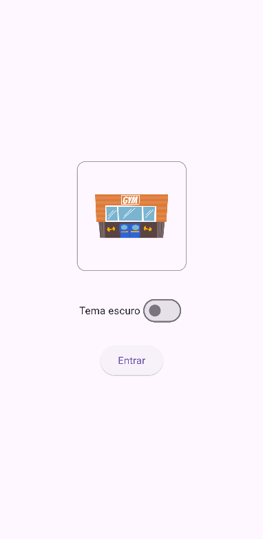
  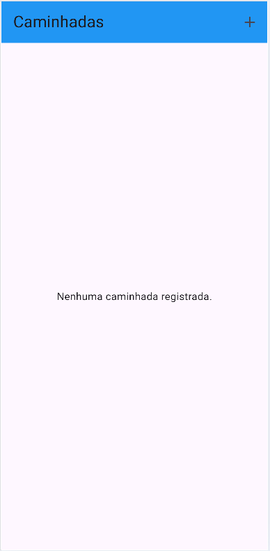
  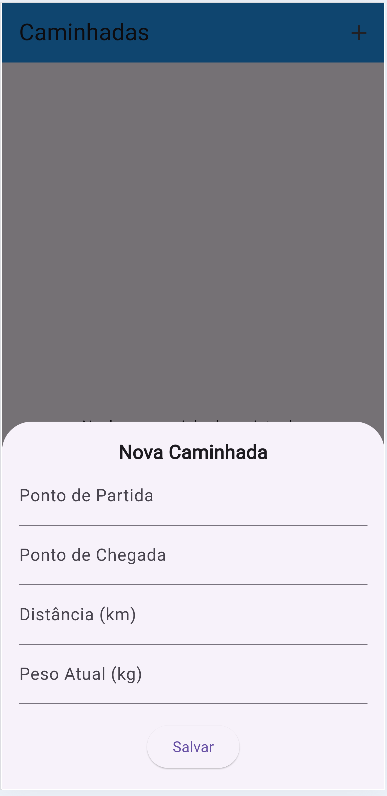
  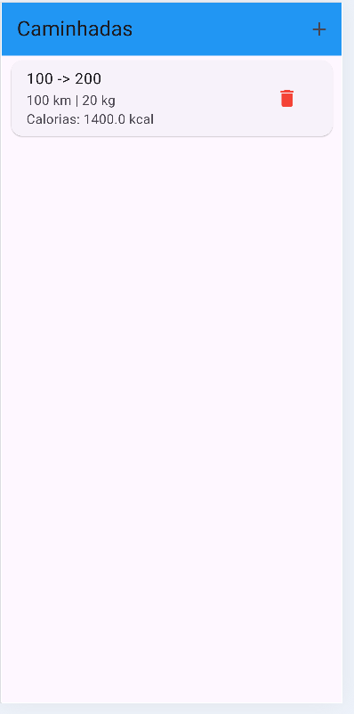
</p>

---

### 2. Consumo de Água (`flutter_desafio2`)
Controle de ingestão diária de água com meta diária calculada com base no peso do usuário.
* **Fórmula:** `Meta Diária (ml) = Peso (kg) × 35 ml`
* **Recursos:** Exibição em cards, porcentagem da meta atingida, gráfico de consumo e salvamento local.

<p align="center">
  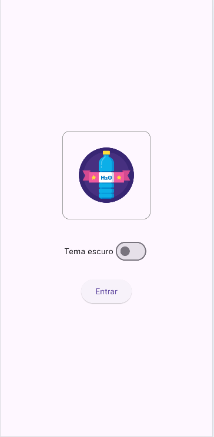
  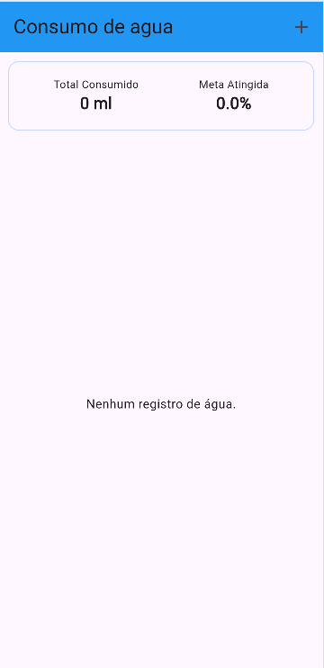
  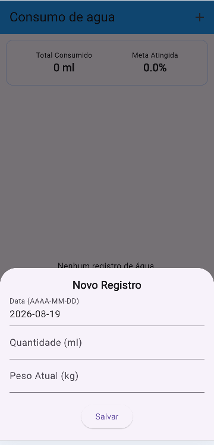
  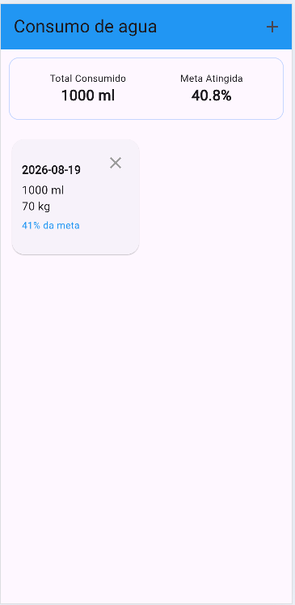
</p>

---

### 3. Abastecimento de Veículos (`flutter_desafio3`)
Histórico de combustível para acompanhamento do preço médio por litro e rendimento do veículo.
* **Cálculos:** Preço médio por litro (`Valor ÷ Litros`) e consumo médio (`km/L`) considerando o abastecimento anterior.
* **Recursos:** Cabeçalho com métricas médias, gráfico comparativo, modal de edição e armazenamento local.

<p align="center">
  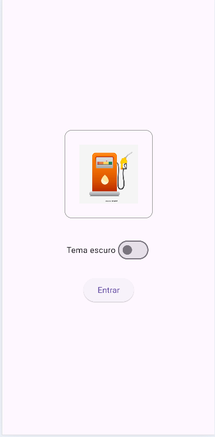
  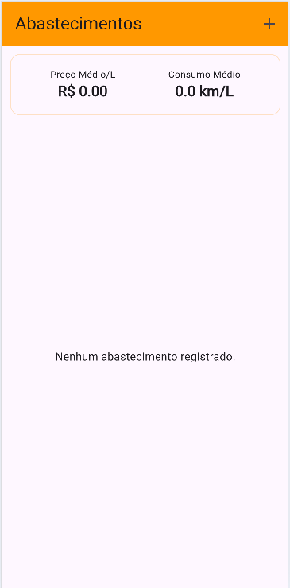
  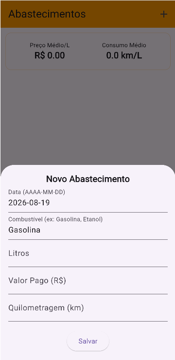
  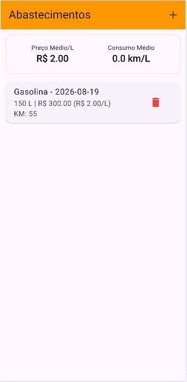
</p>

---

##  Tecnologias
- **Linguagem:** Dart
- **Framework:** Flutter
- **Persistência:** Armazenamento Local
- **UI:** Suporte a Tema Claro / Escuro

---

##  Como Executar

1. Clone o repositório:
   ```bash
   git clone [https://github.com/seu-usuario/seu-repositorio.git](https://github.com/seu-usuario/seu-repositorio.git)
Entre na pasta do desafio que deseja testar:
cd flutter_desafio1

Instale as dependências:
 ```bash
flutter pub get
 ```
Execute a aplicação:
  ```bash
flutter run
```
1. Clone o repositório:
   ```bash
   git clone [https://github.com/seu-usuario/seu-repositorio.git](https://github.com/seu-usuario/seu-repositorio.git)
